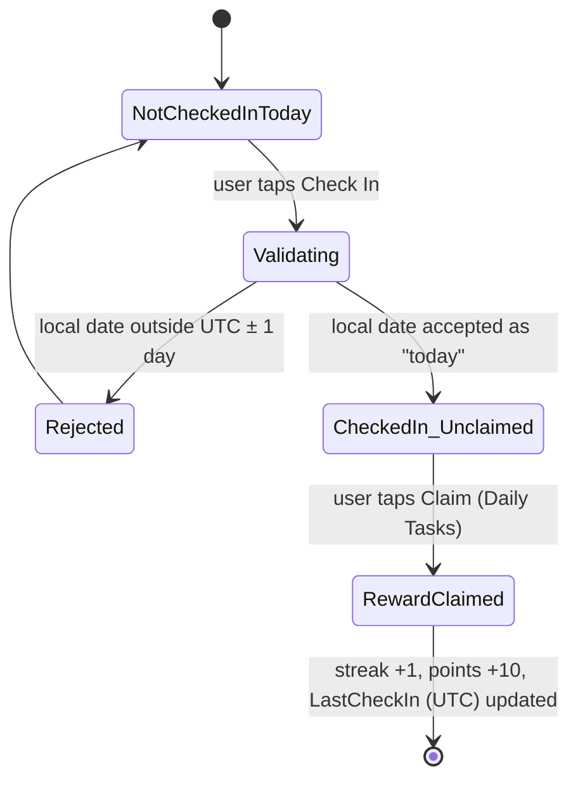
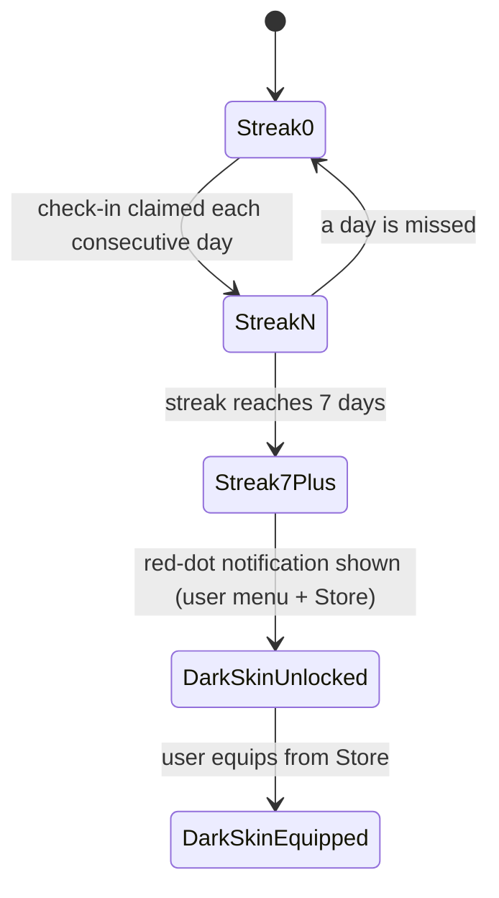

# Design Decisions

Key decisions made during development, with the reasoning behind them and the real conversation that produced each one. Written as reference material for the submission video's "design decisions" section. Prompt references point into `03-ai-prompt-log-web.md` (early planning) and `04-ai-prompt-log-vscode.md` (implementation).

## 1. Check-in "today" = client's local date, clamped ±1 day of server UTC

**Problem found:** a check-in made at 11:47pm local time was stored under the *previous* calendar date, because the server originally computed "today" via `DateOnly.FromDateTime(DateTime.UtcNow)` — correct for UTC, wrong for any user not near UTC+0 (`04-ai-prompt-log-vscode.md`, P-08).

**Decision:** the client sends its own local date; the server clamps it to within ±1 day of UTC to block trivial spoofing, rather than trusting either side alone.

**Known trade-off, deliberately accepted:** a user who physically changes timezone between two check-ins (e.g. flying across the date line) can still produce two different, both-valid `Date` values within one real-world day, double-paying streak/points. This was identified live in the same session and consciously deferred in favor of shipping the core feature set, and is written up as a self-reflection item in the root README instead of fixed. The correct fix (an 18–20h cooldown against `User.LastCheckIn`, a real UTC timestamp immune to spoofing) is documented but not implemented.

## 2. Points are claimed, not auto-granted

Initially, completing a check-in or workout record would grant points immediately. This was deliberately changed so the user must click a separate "claim reward" action after completing the task (`04-ai-prompt-log-vscode.md`, P-09). This adds a second, deliberate interaction step to the gamification loop rather than a single passive one — a small HCI choice to make the reward feel like an action, not a side effect.

## 3. Skins are streak-gated, not just point-purchasable

The dark "night" skin unlocks specifically at a 7-day check-in streak rather than being buyable outright (`04-ai-prompt-log-vscode.md`, P-10). Combined with the points-shop skins, this gives two different reasons to return daily: one that rewards consistency (streaks) and one that rewards accumulation (points) — deliberately not collapsing both into a single currency.

## 4. Deployment platform: Azure Container Apps, not Azure App Service

The first deployment attempt used Azure App Service with a GitHub Actions build/deploy workflow. This was abandoned after running into cost and Docker-workflow friction (`04-ai-prompt-log-vscode.md`, P-15). The project had already been Dockerized for local dev, so Azure Container Apps was chosen instead specifically because it could run the *same* container images built for local `docker-compose`, keeping local and production environments identical rather than maintaining a second non-container deployment path.

## 5. Rank page: dedicated routes per leaderboard tab, not shared component state

A production bug caused the podium/list to duplicate when switching between leaderboard tabs (daily check-in / calorie burn / streak) if more than 3 entries were shown. Rather than patching the symptom, the fix gave each tab its own route so React fully remounts the relevant component on tab switch instead of mutating shared state in place (`04-ai-prompt-log-vscode.md`, P-16).

## 6. Responsive fix: continuous `clamp()` offset instead of a hard breakpoint

The persistent sidebar/logo had a cosmetic "hug the left edge" negative-margin trick that only worked above a wide viewport. The first fix gated it behind a hard breakpoint, but that made the sidebar visibly "jump" at exactly that width during a resize. It was replaced with an inline `clamp()` tied to the actual leftover gutter width (`calc((1280px - 100vw) / 2)`), so the offset eases in continuously with viewport width instead of snapping — no JS, no breakpoint (`04-ai-prompt-log-vscode.md`, P-18).

## 7. Frontend test folder mirrors backend test folder structure

The backend keeps tests in a separate `backend.Tests/` project (idiomatic for .NET). The frontend tests, originally colocated with source files, were moved into their own `frontend/tests/` folder to match that layout (`04-ai-prompt-log-vscode.md`, P-19), prioritizing structural consistency across the two halves of the stack over the (also common) React convention of colocating tests with components.

## 8. Security measures chosen: password hashing + data validation, not RBAC/CSRF/rate-limiting

Of the five options listed in the assessment (RBAC, anti-CSRF, password hashing, data validation/sanitisation, rate limiting), password hashing (BCrypt) and data validation (FluentValidation) were chosen as the two justified measures back during initial scope planning (`03-ai-prompt-log-web.md`, P-03). This matched the app's actual shape — a single-role app (no admin/user permission tiers to gate, so RBAC has no real surface) built as a same-origin SPA + API pair — rather than adding measures that wouldn't correspond to a real attack surface in this app.
